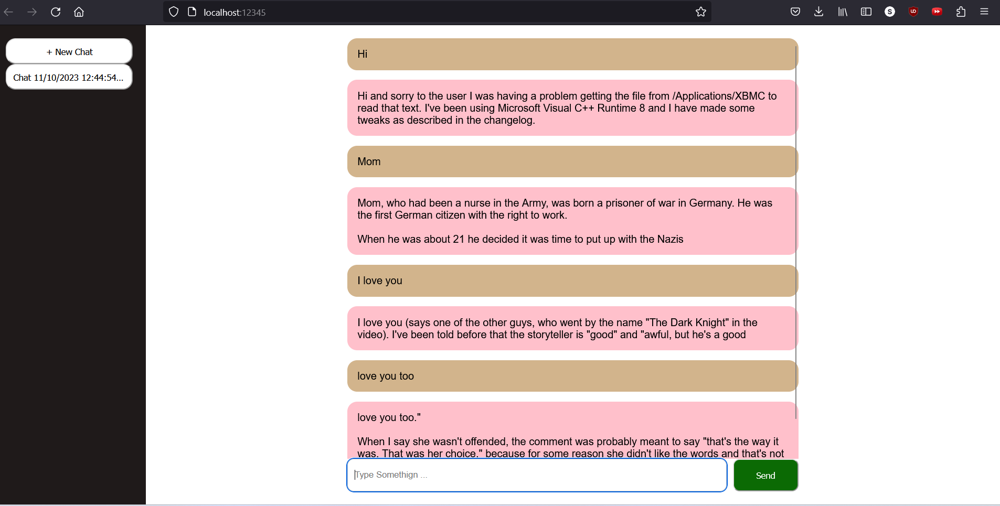

# Chatbot with pure HTMX 
### Inspired from https://github.com/unconv/ChatHTMX
### I used php server for backend
### I used flask server for AI responses. Transformer library default text-generation 'distil-gpt2' model is used

# Installation

`git clone https://github.com/harsh-lodha/chathtmx-php.git`

### php installation

https://www.php.net/downloads (download php)

### Add php to environment variable : 
Search -> Edit the System Environment Variable -> Environment Variable ->  
System Variable -> Path -> Edit ->  
New -> C:\your\path\to\php\installation (C:\Program Files\php-8.2.12-Win32-vs16-x64\) 

### enable extensions and curl library
In the php installation directory , open 'C:\Program Files\php-8.2.12-Win32-vs16-x64\php.ini-development' 
Remove semicolon in folowing lines : 
`;extension_dir = "ext"` -> `extension_dir = "ext"` 
`;extension=curl` -> `extension=curl` 

# Usage
Install the requirements  
`python -m requirements.txt` 
Start the Flask server (default port: 5000) 
`python api.py` 
Start the php server(in new terminal) 
`php -S localhost:12345` 

# UI
